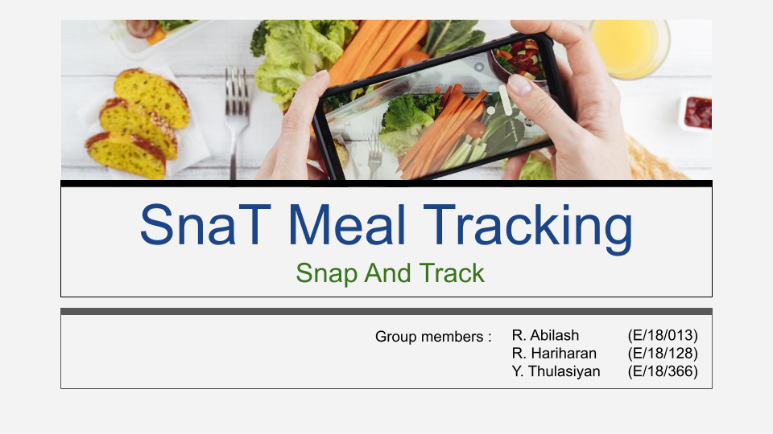
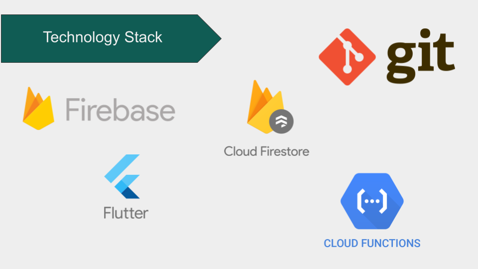
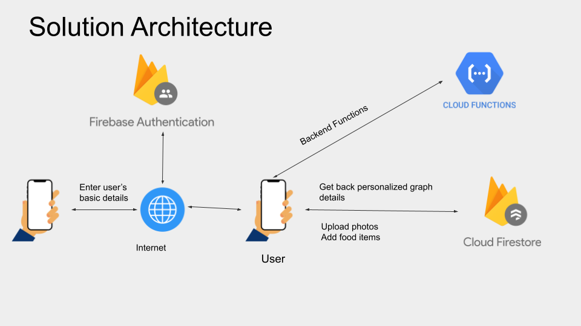
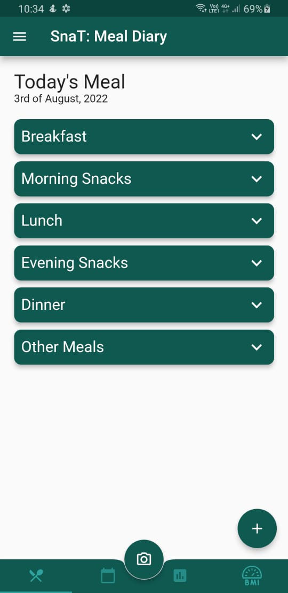
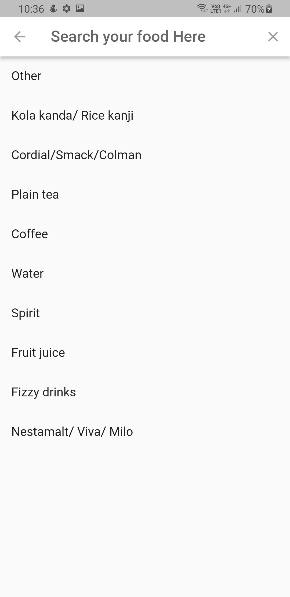
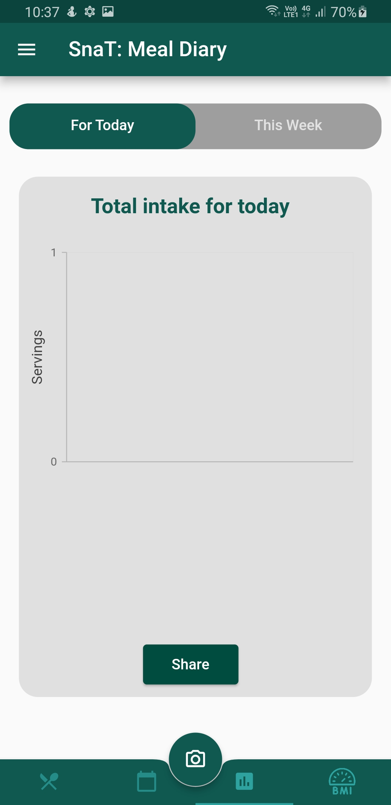
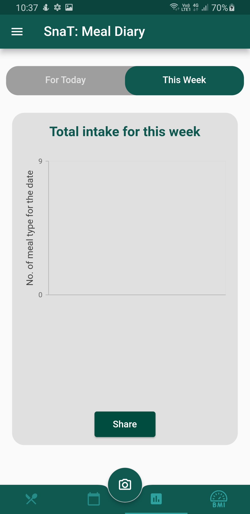
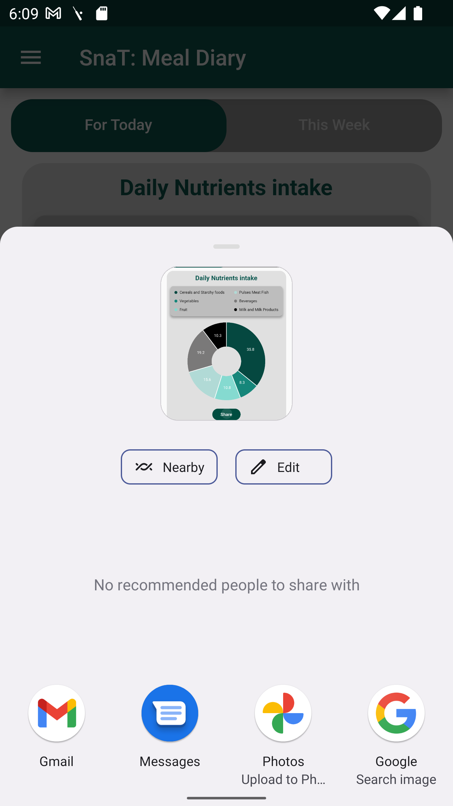
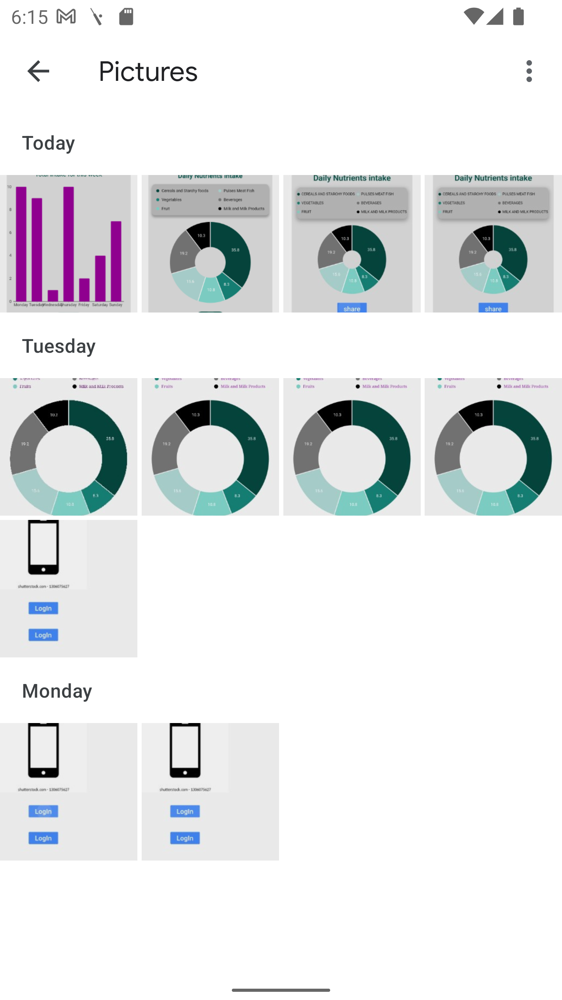
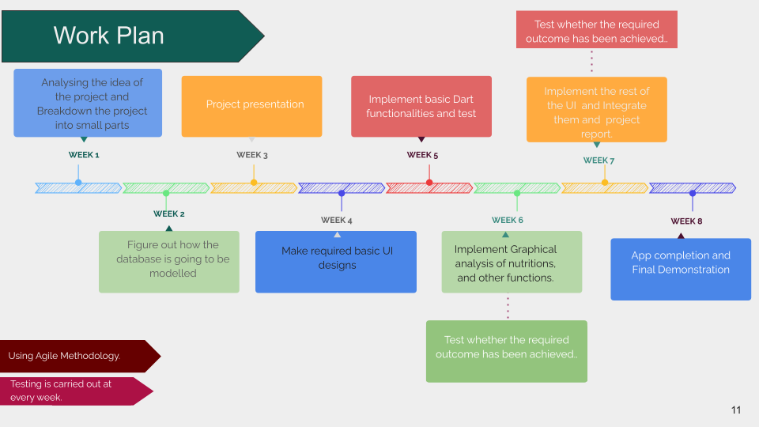

[comment]: # "This is the standard layout for the project, but you can clean this and use your own template"

# SnaT Meal Tracking App

---

## Team
-  E/18/013,Abilash R., [e18013@eng.pdn.ac.lk](mailto:e18013@eng.pdn.ac.lk)
-  E/18/128,Hariharan R., [e18128@eng.pdn.ac.lk](mailto:e18128@eng.pdn.ac.lk)
-  E/18/366,Thulasiyan Y., [e18366@eng.pdn.ac.lk](mailto:e18366@eng.pdn.ac.lk)

## Table of Contents
1. [Introduction](#introduction)
2. [Technology Stack](#technology-stack)
3. [Solution Architecture](#solution-architecture)
4. [Features](#features)
5. [Work Plan](#work-plan)
6. [Links](#links)

---

# Introduction

&emsp;SnaT(Snap and Track) is a first application available in both iOS, and Android that is built based on Sri Lankan food style so that Users can maintain their meal progress and maintain their health by taking AI assisted food statistics. 

&emsp;Promoting mHealth for the betterment of community health is an ongoing intervention which is timely. The world is passing through a digital era, and Sri Lanka has also shown a rapid tendency towards this in recent times. This is currently being used mostly to create a healthy dietary modification in the community. According to the literature, person informatics and self-tracking systems are most useful to proceed personal dietary modification and its ths self reflection towards healthy eating. For this, the most widely used meal tracking application in the world is new to Sri Lanka. Also, self-reflecting on one's eating pattern by tracking the photos of the food one has taken is another unique thing. 

&emsp;Therefore SnaT is a novel meal tracking app which has been developed in a Sri Lankan context to fulfill those identified gaps in the community. Currently SnaT has been developed in which to track meals in adult population and it is  consisting with a very simple concept of balanced meal by all food groups which is very easy to understand by the normal population spontaneously. Therefore, SnaT, combined with digital technology , will make a great contribution to promoting a healthy diet in the Sri Lankan community.

  

# Technology Stack

These technologies were used to create the application.
### Flutter 
  
  Why Flutter?
  - Available in many platforms for the same code base
  - Various Widget Libraries
  - Hot Reload
  - Easy to integrate with all Google services
  
### Firestore and Firebase 
  
  Why Firestore and Firebase?
  - Has both real time, and No-SQL database
  - Scalability, and Security
  - Cloud functions
  - Handling concurrent users
  - Provides all type of authentication services

### Git
  
  Git is a DevOps tool used for source code management. It is a free and open-source version control system used to handle small to very large projects efficiently. Git is used to tracking changes in the source code, enabling multiple developers to work together on non-linear development. 

# Solution Architecture

# Features

### Maintain Meal Details

Select the date (if same day , no need to select date), meal type  , the relevant food from the list (if that food is not  in the list user  able to enter that food to the relevant food group) and quantity according to the suggested  unit.
Users can edit and delete data by selecting  the date.

<table align="center">
  <tr>
    <td align="center">Added Meals</td>
     <td align="center">Search and add meals</td>
     <td align="center">Adding Meals</td>
  </tr>
  <tr>
    <td align="center"></td>
    <td align="center"></td>
    <td align="center"></td>
  </tr>
 </table>

### Output/Results

User can see the   daily/ Monthly/weekly results according to the food groups whether they are beyond the expected range, within the expected  range or below the expected range by charts.

<table align="center">
  <tr>
    <td align="center">Daily report</td>
     <td align="center">Weekly report</td>
  </tr>
  <tr>
    <td align="center"></td>
    <td align="center"></td>
  </tr>
 </table>

### Connect  to social  media

Users can share  their  results  to social media directly from the app.

<table align="center">
  <tr>
    <td align="center">Share</td>
     <td align="center">Screenshot</td>
  </tr>
  <tr>
    <td align="center"></td>
    <td align="center"></td>
  </tr>
 </table>

# Work plan

## Links

- [Project Repository](https://github.com/cepdnaclk/{{ page.e18-co227-SnaT-Meal-Tracking-App-Group-A }}){:target="_blank"}
- [Project Page](https://cepdnaclk.github.io/{{ page.e18-co227-SnaT-Meal-Tracking-App-Group-A}}){:target="_blank"}
- [Department of Computer Engineering](http://www.ce.pdn.ac.lk/)
- [University of Peradeniya](https://eng.pdn.ac.lk/)

[//]: # (Please refer this to learn more about Markdown syntax)
[//]: # (https://github.com/adam-p/markdown-here/wiki/Markdown-Cheatsheet)
